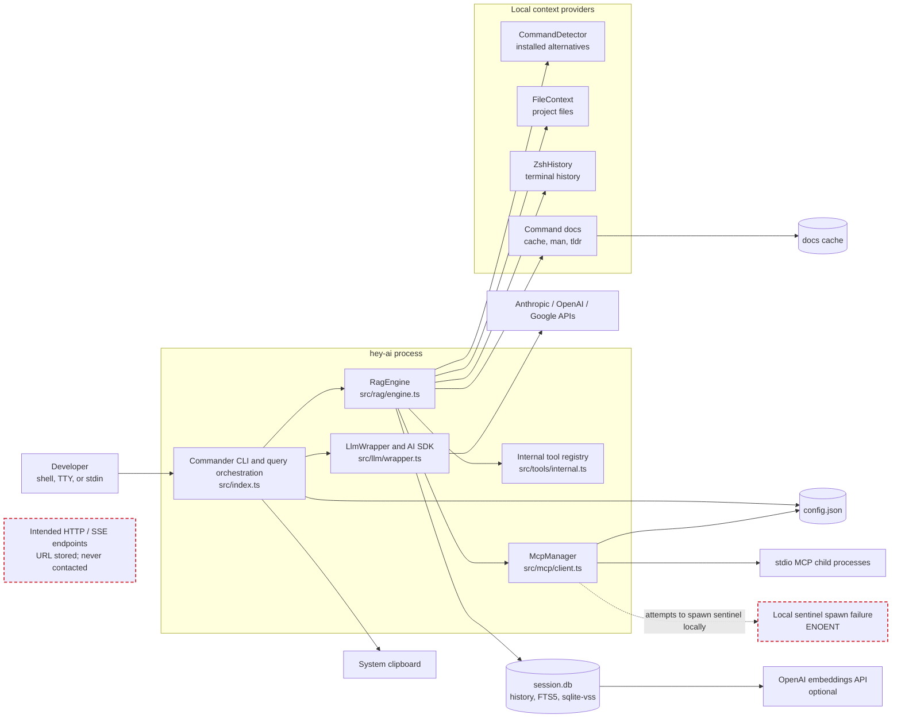
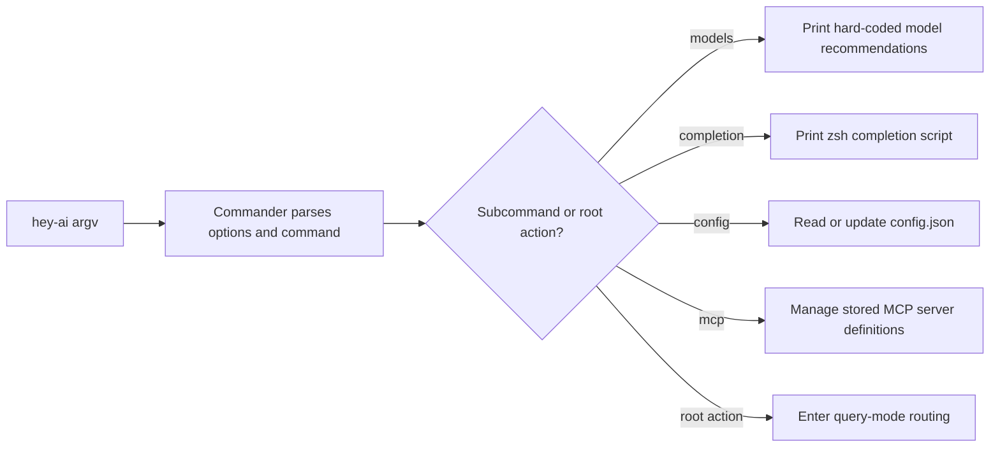
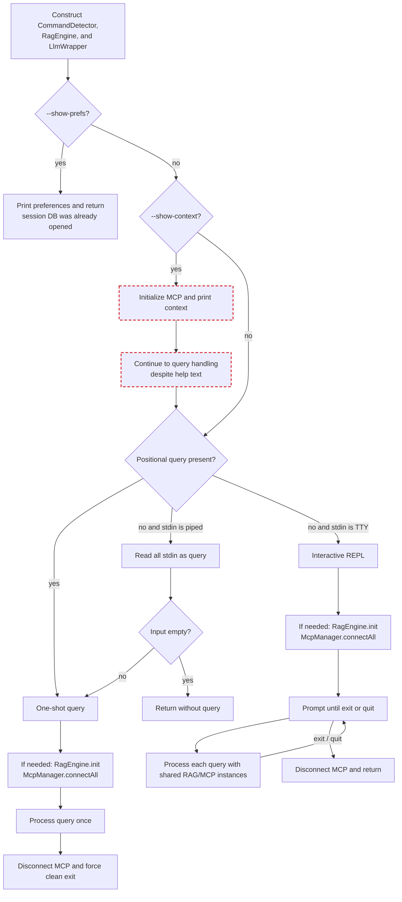
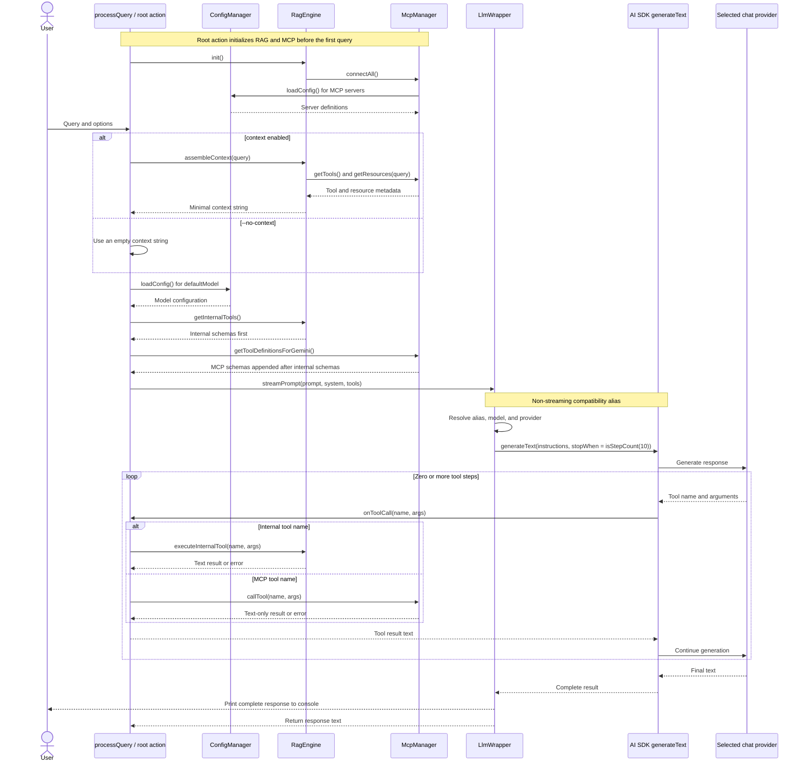
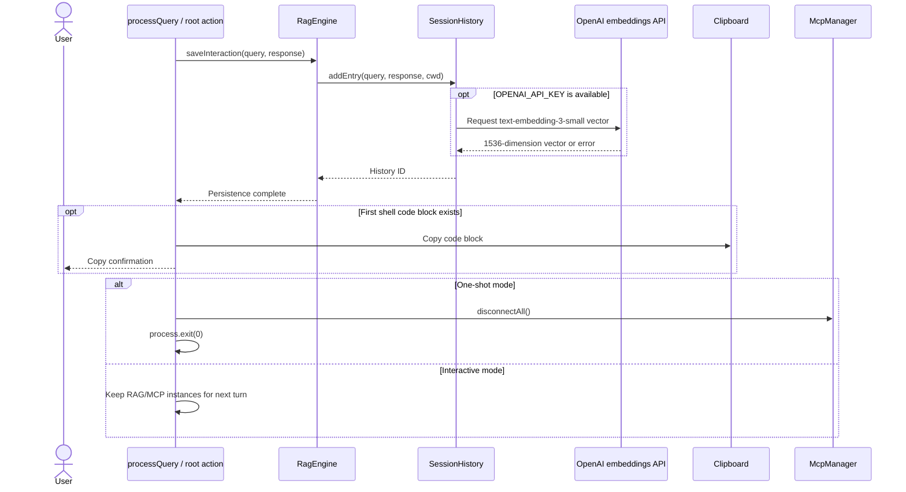
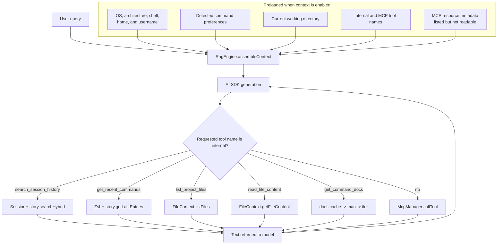
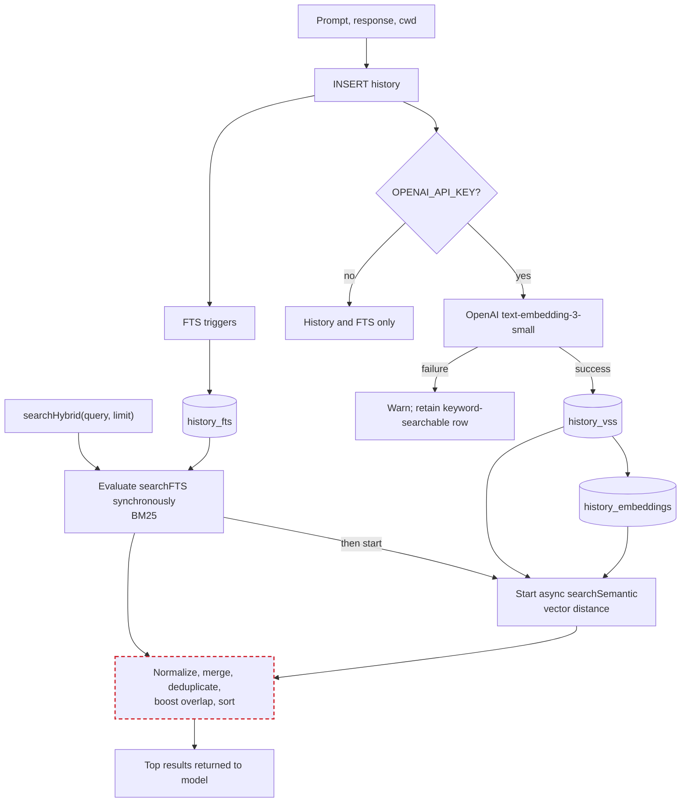
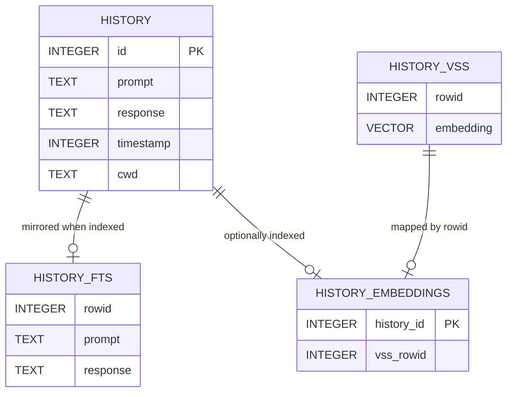
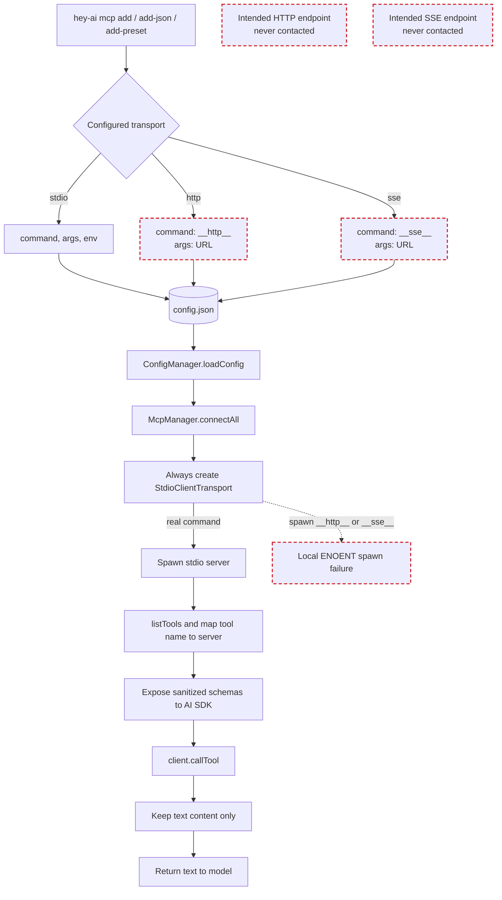
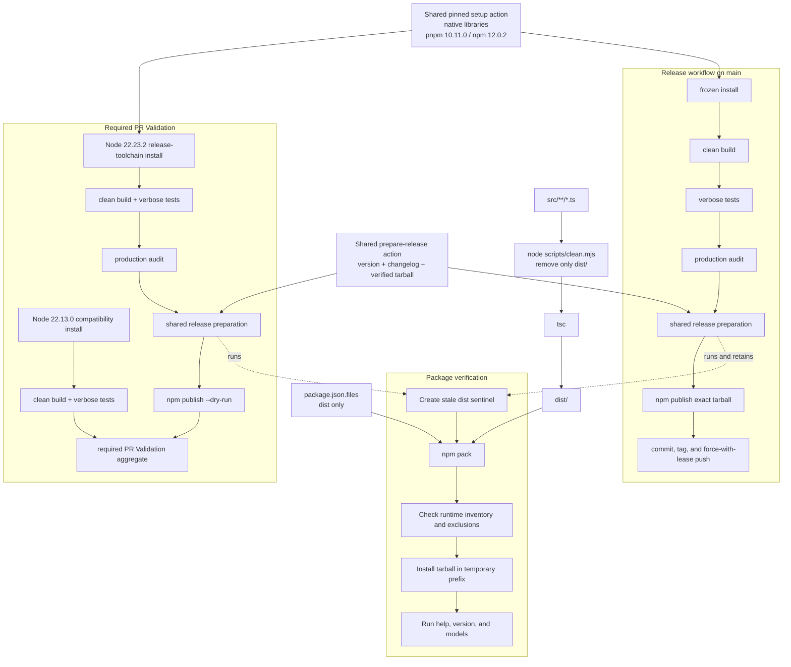

# hey-ai Architecture

This document describes the current `v0.6.1` implementation. Red dashed nodes
identify confirmed defects or non-operational paths; dotted edges show failed,
indirect, or intended relationships. See the
[codebase audit](./codebase-audit.md) for evidence and the
[backlog](../TODO.md) for planned remediation.

## System and component topology

`src/index.ts` is both the CLI definition and the query orchestrator. A
`RagEngine` facade owns context providers, persistence, and MCP connectivity;
`LlmWrapper` adapts model providers and AI SDK tools.

The CLI has no dependency-injection boundary in its production entrypoint.
Constructing `RagEngine` immediately constructs `SessionHistory`, loads the
sqlite-vss extension, creates the session schema, detects commands, and creates
an `McpManager`. This eager work also occurs for lightweight root options such
as `--show-prefs`.

## CLI modes and command routing

Commander exposes four subcommands plus the root query action. Subcommands
manage or display state without entering the root query lifecycle. The root
action supports a positional query, piped input, and an interactive prompt.

The root action then selects its input mode and initializes MCP before the first
query that needs it:

`--no-history` and `--no-files` are parsed but never read. `--no-context`
skips the minimal preloaded context string, but MCP still initializes and all
internal and MCP tools are still available to the model.

## Query and tool-call lifecycle

Generation uses AI SDK `generateText`, not streaming. `streamPrompt()` is a
compatibility alias around the same non-streaming method. The public `system`
option is passed to the SDK as `instructions`, and `stopWhen: isStepCount(10)`
bounds the model/tool loop. OpenAI models use the provider's explicit Chat
Completions factory rather than its default Responses API factory.

Post-response persistence and cleanup happen after the user has already seen
the full answer:

The completed response is printed before persistence finishes, but clipboard
completion and one-shot shutdown wait for `saveInteraction()`, including the
optional embedding request.

## Context and tool routing

Only small, generally useful context is assembled before generation. Expensive
or potentially irrelevant context is exposed as tools for the model to request.

Tool routing is based on an unqualified global name. An MCP tool that collides
with an internal tool can replace the schema exposed to the AI SDK while still
being executed as the internal tool. Duplicate names across MCP servers are
silently mapped to the last connected server.

## Session persistence and hybrid retrieval

`SessionHistory` uses one SQLite database with a regular history table, an
external-content FTS5 table synchronized by triggers, a sqlite-vss virtual
table, and a mapping table. Embeddings are optional; keyword search remains
available without an OpenAI key.

Although the results are collected with `Promise.all()`, JavaScript evaluates
the synchronous `searchFTS()` call before `searchSemantic()` is started.

The current BM25 normalization reverses keyword relevance and compresses the
displayed scores near 100%. Existing rows are also not rebuilt into FTS if the
FTS table is introduced after those rows already exist.

The stores and inputs used by the context system are:

| Data | Default location | Behavior |
| --- | --- | --- |
| Application configuration | `~/.config/hey-ai/config.json` | Model and MCP server definitions |
| Session history | `~/.config/hey-ai/session.db` | Global across projects; `cwd` is stored but not used to scope search |
| Command docs cache | `~/.cache/hey-ai/docs` | File cache with a 100 MB LRU-style size limit |
| Shell history | `$HISTFILE` or `~/.zsh_history` | Extended zsh-history lines only |
| Project files | Current working directory | Globby scan to depth three; reads are requested on demand |

## MCP configuration and runtime

The CLI accepts stdio, HTTP, and SSE declarations. Configuration normalizes
remote transports into sentinel commands, but `McpManager.connectAll()` always
constructs `StdioClientTransport`. The sentinel is therefore passed to
`spawn()` as if it were an executable.

MCP resources are enumerated into the prompt as metadata, but the CLI exposes
no resource-read operation. Tool results discard structured content, resource
blocks, images, and audio. JSON Schema support is also partial: references and
definitions are removed, while the JSON Schema-to-Zod converter handles only a
small subset of schema forms.

## Build, package, and release flow

The repository supports Node.js 22.13+ within Node 22. `pnpm run build` first
removes the explicit `dist/` directory through a cross-platform Node script,
then compiles TypeScript into a fresh output tree. `package.json.files` permits
only `dist/`; npm also includes `package.json` and README automatically.

`prepack` performs the same clean build. `pnpm run test:package` deliberately
adds stale output before packing, verifies every source runtime module and the
internal tool modules in the inventory, rejects files outside the release
allowlist, installs the tarball into a temporary prefix with an isolated npm
cache/configuration, and runs the installed `--help`, `--version`, and `models`
commands. An optional output path retains the verified tarball for release. Its
metadata parser accepts both npm 10's array output and npm 12's package-name map.

The PR release preflight and release use the same composite actions to install
Node, pnpm, npm, native libraries, and to perform versioning, changelog
generation, artifact verification, and release preparation. The toolchain is
pinned rather than upgraded implicitly: release uses Node 22.23.2, pnpm
10.11.0, and npm 12.0.2. A separate CI job covers the minimum supported Node
22.13.0 runtime with its compatible bundled npm. A PR performs an
`npm publish --dry-run`; the main-branch workflow switches only that final
preparation flag off before publishing the already-verified tarball.

These gates resolve the audit's artifact-completeness and production-advisory
blockers. The release workflow still commits and force-pushes version/changelog
changes after publication, and its generated release text still contains an
obsolete prerequisite; those risks remain in the [prioritized backlog](../TODO.md).

## Current architectural constraints

- Query orchestration, command registration, the system prompt, and MCP presets
  are combined in a single large entrypoint.
- Root-query construction eagerly opens local state before knowing which mode
  needs it, and command detection is duplicated for `--show-prefs`.
- MCP uses the SDK's fixed 60-second request default with no CLI-configurable
  timeout, cancellation surface, or aggregate multi-server startup deadline;
  tool discovery is repeated during connection, context assembly, and query
  preparation.
- Session history and semantic indexing are global, not project-scoped. If an
  OpenAI key is present, saved conversations are embedded through OpenAI even
  when a different provider handled the chat request.
- File access uses lexical path containment. Symlinks can escape the working
  directory, and line-based truncation does not bound a huge single-line or
  binary file before it is read.
- Forced `process.exit()` is used to guarantee one-shot shutdown; SQLite has no
  explicit close lifecycle.
- Provider aliases and descriptions are hard-coded and drift independently
  from provider availability.
